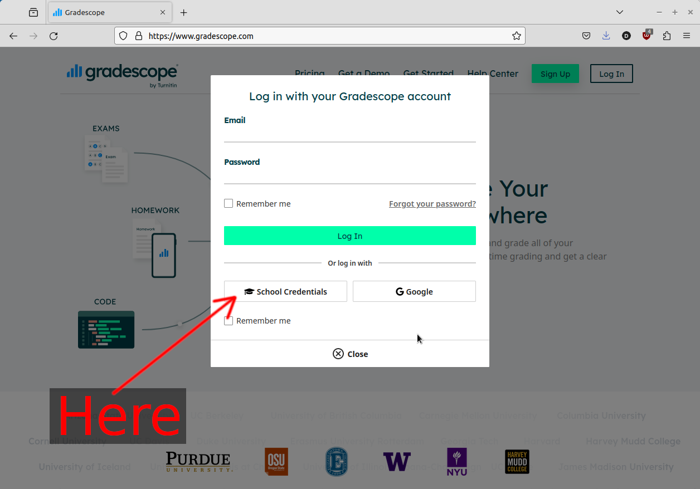
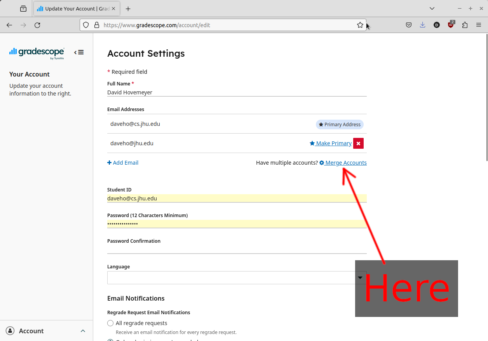

This page has information about accessing Gradescope.

## Logging in using "School Credentials"

If you were enrolled in the course just prior to the beginning of the
semester, then we registered you in the course on Gradescope using
an email with the form `JHEDID@jh.edu`. In theory, this should allow
you to log into Gradescope using the "School Credentials" option
on the login screen:

## Setting a new password

If logging into Gradescope using "School Credentials" doesn't work,
try clicking the "Forgot your password?" link, and then
entering your JHU email in the form `JHEDID@jh.edu` (where
`JHEDID` is your JHED ID). You should receive an email with a link
to set a password, then you should be able to log in using email/password.

## Merging your registration into another Gradescope account

If you need to merge your CSF Gradescope registration with a different
Gradescope account (e.g., one that's under a different email), log into
that account, click "Account" in the lower left of the window, choose
"Edit Account", then click the "Merge Accounts" link:

## If none of this works

Email <mailto:daveho@cs.jhu.edu> if none of the above options result in you
being able to see the course in Gradescope.
